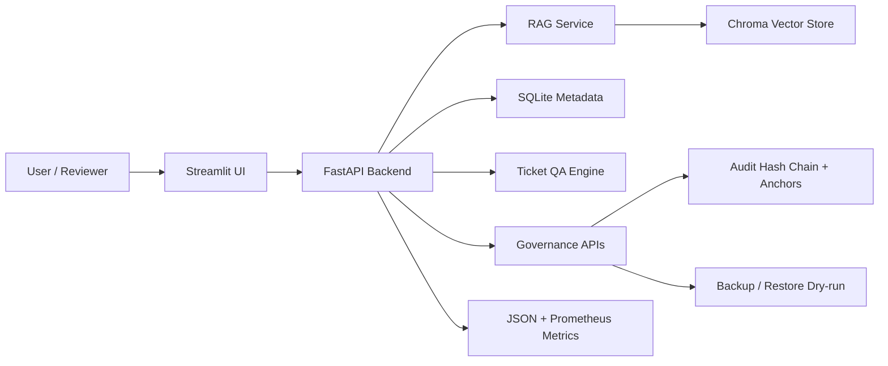

# ServiceGuard Agent

[](https://github.com/chengzi030109/ServiceGuard_Agent/actions/workflows/serviceguard-ci.yml)


[](LICENSE)

企业知识库驱动的客服/工单质检 Agent。

ServiceGuard Agent 使用 RAG 检索企业 SOP、售后政策、隐私合规规则等文档，并对客服对话输出结构化质检报告，包括风险等级、违规类型、政策引用、建议回复和人工复核提示。

## 一眼看懂

- 它解决什么：把企业知识库接入客服质检，让每条风险判断都尽量绑定政策引用和复核状态。
- 它适合什么：企业内部 POC、实习项目投递、面试演示和客服合规 Agent 原型验证。
- 它现在有什么：FastAPI 后端、Streamlit 中英文前端、RAG 检索、批量质检、人工复核、审计哈希链、可签名审计锚点、Prometheus 指标、Docker Compose 和 GitHub Actions CI。
- 它还不是什么：不是完整生产级 SaaS；多租户账号体系、PostgreSQL/Alembic、异地灾备、对象存储和正式审批流仍属于后续路线。

## 架构概览



## 功能

- 文档上传：支持 TXT、Markdown、PDF，入库前会对常见敏感信息和密钥/token 做脱敏处理，并扫描提示注入风险；默认会隔离高风险文档，管理员批准后才进入向量库。
- 知识库检索：chunk 切分、embedding、Chroma 本地向量库、Top-k citation。
- RAG 问答：基于检索内容回答，并返回来源。
- 工单质检：输出 score、risk_level、violations、citations、suggested_reply。
- 批量质检：上传 CSV 后逐条生成报告，支持同步处理、后台任务查询和任务取消。
- 人工复核：高风险或缺少依据的报告自动进入待复核队列，管理员可标记 approved/rejected/escalated。
- 数据治理：管理员可 dry-run 预览并清理过期报告、LLM 日志、批量任务和审计事件，也可扫描/修复历史知识库中的敏感信息，并巡检/复核历史知识库提示注入风险。
- 备份快照：管理员可创建、列出、校验、恢复演练和下载 ZIP 备份，包含 SQLite 元数据和上传文件，可选包含 Chroma 向量库；manifest 带文件级 SHA256 清单。
- 日志观测：记录 request_id、model、prompt_version、latency_ms、token、错误和工具链路；提供 JSON/Prometheus 指标和示例告警规则；审计事件带哈希链、校验和可签名锚点证据。
- 前端 Demo：Streamlit 支持上传、问答、单条质检、批量质检、知识库安全复核、人工复核和运维中心。
- 中英文界面：前端默认中文，可在侧边栏一键切换 English。
- 企业化配置：用户/管理员 API key、报告/后台任务用户隔离、CORS 白名单、全局请求体/上传大小限制、接口限流、request id、安全响应头、ready/metrics/audit、安全状态总览、前端运维中心、数据库 schema 版本台账。
- 隐私与知识库安全：工单进入检索、模型调用、响应和落库前会脱敏手机号、邮箱、身份证和银行卡；上传知识库文档在 chunk/向量化前会脱敏手机号、邮箱、身份证、银行卡、OpenAI key、JWT、Bearer token 和常见 secret/password 字段，并标记/隔离可疑提示注入指令。
- 无密钥演示：没有 OpenAI API key 时使用本地 deterministic fallback，方便测试和面试演示。

## 技术栈

- Backend: Python, FastAPI, Pydantic v2, SQLite
- RAG: Chroma, OpenAI-compatible embeddings, local fallback embeddings
- Agent workflow: hand-written controlled workflow
- Frontend: Streamlit
- Quality: pytest, ruff
- Deploy: Docker, Docker Compose, GitHub Actions CI

## 本地启动

```powershell
python -m venv .venv
.\.venv\Scripts\Activate.ps1
pip install -r requirements.txt
copy .env.example .env
```

启动后端：

```powershell
uvicorn backend.app.main:app --reload --host 0.0.0.0 --port 8000
```

启动前端：

```powershell
streamlit run frontend/app.py
```

访问：

- API docs: http://localhost:8000/docs
- Streamlit: http://localhost:8501

## Docker 启动

```powershell
docker compose up --build
```

`.dockerignore` 会排除 `.venv`、本地数据库、Chroma、上传文件、日志、备份和学习资料，只把应用代码、依赖文件和样例数据放入 Docker 构建上下文，避免把本机隐私数据或大体积缓存打进镜像。

可选启动监控栈：

```powershell
docker compose -f docker-compose.yml -f docker-compose.monitoring.yml --profile monitoring up --build
```

访问：

- Prometheus: http://localhost:9090
- Alertmanager: http://localhost:9093

可选启动 Nginx 统一入口：

```powershell
docker compose -f docker-compose.yml -f docker-compose.gateway.yml --profile gateway up --build
```

访问：

- Gateway: http://localhost:8080
- API docs: http://localhost:8080/docs

本地 gateway 使用 `deploy/nginx/serviceguard.conf`，把 `/api`、`/health`、`/ready`、`/metrics` 转发到后端，把 Streamlit 页面和 `/_stcore` WebSocket 转发到前端。生产 HTTPS 示例见 `deploy/nginx/serviceguard_tls.example.conf`，需要替换域名和证书路径后使用。

## 样例数据

- 政策文档：`data/sample_docs/`
- 工单 CSV：`data/samples/tickets_sample.csv`

可以先上传 `data/sample_docs/` 下的 Markdown 文档，再用样例工单测试质检。

## 项目资料

- [企业化就绪说明](docs/enterprise_readiness.md)
- [实现计划](IMPLEMENTATION_PLAN.md)
- [学习资料与阶段计划](docs/learning-materials/README.md)

## API

| 方法 | 路径 | 说明 |
| --- | --- | --- |
| GET | `/health` | 健康检查 |
| GET | `/ready` | 依赖就绪检查 |
| GET | `/metrics` | JSON 基础运行指标，包含待复核报告数量 |
| GET | `/metrics/prometheus` | Prometheus 文本格式运行指标 |
| POST | `/api/documents/upload` | 上传文档并入库，返回 chunks_indexed、sensitive_redactions 和 prompt_injection_risks |
| GET | `/api/documents` | 文档列表 |
| POST | `/api/admin/documents/{doc_id}/approve` | 管理员批准隔离文档入库并写入向量库 |
| POST | `/api/admin/documents/{doc_id}/reject` | 管理员拒绝隔离文档并清空对应索引 |
| DELETE | `/api/documents/{doc_id}` | 删除文档 |
| POST | `/api/search` | 测试知识库检索 |
| POST | `/api/chat` | RAG 问答 |
| POST | `/api/tickets/inspect` | 单条工单质检 |
| POST | `/api/tickets/batch` | 批量 CSV 质检 |
| POST | `/api/tickets/batch/jobs` | 创建后台批量质检任务；可带 `Idempotency-Key` 防止客户端重试重复创建 |
| GET | `/api/tickets/batch/jobs` | 查询后台批量质检任务列表 |
| GET | `/api/tickets/batch/jobs/{job_id}` | 查询后台批量质检任务 |
| POST | `/api/tickets/batch/jobs/{job_id}/cancel` | 取消本人或管理员可见的后台批量任务 |
| GET | `/api/reports` | 查看本人或管理员可见的报告列表，可按 review_status 过滤 |
| GET | `/api/reports/{report_id}` | 查看本人或管理员可见的质检报告 |
| PATCH | `/api/reports/{report_id}/review` | 管理员处理人工复核状态 |
| POST | `/api/admin/retention/purge` | 管理员 dry-run/执行过期运行数据清理 |
| POST | `/api/admin/documents/privacy/remediate` | 管理员 dry-run/执行历史知识库敏感信息扫描与脱敏修复 |
| GET | `/api/admin/documents/security/scan` | 管理员扫描历史知识库提示注入风险 |
| POST | `/api/admin/backups` | 管理员创建本地 ZIP 备份快照 |
| GET | `/api/admin/backups` | 管理员查看本地备份快照列表 |
| GET | `/api/admin/backups/{backup_id}/verify` | 管理员校验备份 ZIP、manifest、文件 SHA256 和 SQLite 完整性 |
| POST | `/api/admin/backups/{backup_id}/restore/dry-run` | 管理员执行只读恢复演练，不覆盖当前数据 |
| GET | `/api/admin/backups/{backup_id}/download` | 管理员下载指定备份快照 |
| GET | `/api/admin/security/status` | 管理员查看运行安全状态总览 |
| GET | `/api/logs` | 管理员查看调用日志 |
| GET | `/api/audit-events` | 管理员查看审计事件 |
| GET | `/api/audit-events/verify` | 管理员校验审计事件哈希链 |
| POST | `/api/admin/audit-anchors` | 管理员创建当前审计链锚点证据 JSON |
| GET | `/api/admin/audit-anchors` | 管理员查看本地审计锚点列表 |
| GET | `/api/admin/audit-anchors/{anchor_id}/verify` | 管理员校验锚点 manifest、签名和当前审计前缀 |

兼容 Week 1/2 计划中的短路径：`/documents/upload`、`/documents`、`/search`、`/chat`、`/tickets/audit`。

## 环境变量

见 `.env.example`。若不配置 `OPENAI_API_KEY`，系统仍可用本地 fallback 跑通流程。

生产或企业试点建议设置：

```powershell
REQUIRE_API_KEY=true
API_KEYS=replace-with-strong-user-key
ADMIN_API_KEYS=replace-with-strong-admin-key
# 或使用 SHA-256 哈希形式，避免把明文 key 写进部署配置：
# API_KEY_HASHES=<sha256(user-key)>
# ADMIN_API_KEY_HASHES=<sha256(admin-key)>
# 或放在企业 SSO/API Gateway 后，由可信网关传入用户身份：
# TRUSTED_PROXY_AUTH_ENABLED=true
# TRUSTED_PROXY_AUTH_SECRET=replace-with-strong-random-32-plus-char-proxy-secret
# TRUSTED_PROXY_SECRET_HEADER=X-ServiceGuard-Proxy-Secret
# TRUSTED_PROXY_USER_HEADER=X-ServiceGuard-User
# TRUSTED_PROXY_ROLE_HEADER=X-ServiceGuard-Role
ALLOWED_ORIGINS=https://your-demo-domain.example
MAX_UPLOAD_MB=20
RATE_LIMIT_ENABLED=true
RATE_LIMIT_PER_MINUTE=120
DATA_RETENTION_DAYS=30
AUDIT_RETENTION_DAYS=180
SQLITE_BUSY_TIMEOUT_MS=5000
SQLITE_JOURNAL_MODE=WAL
SQLITE_SYNCHRONOUS=NORMAL
MAX_BATCH_ROWS=500
BATCH_JOB_TIMEOUT_SECONDS=300
MAX_ACTIVE_BATCH_JOBS=20
MAX_ACTIVE_BATCH_JOBS_PER_ACTOR=3
BACKUP_SIGNING_KEY=replace-with-strong-random-32-plus-char-secret
QUARANTINE_PROMPT_INJECTION_DOCUMENTS=true
APP_ENV=production
```

当 `APP_ENV=production` 时，后端启动会执行安全配置自检：必须开启鉴权；必须配置非占位、长度足够的 user/admin 明文 key，或配置合法的 `API_KEY_HASHES` / `ADMIN_API_KEY_HASHES` SHA-256 十六进制摘要，或启用 `TRUSTED_PROXY_AUTH_ENABLED` 并配置至少 32 字符的 `TRUSTED_PROXY_AUTH_SECRET`；`ALLOWED_ORIGINS` 不能是 `*`，必须开启限流，必须配置 OpenAI-compatible API key，必须配置至少 32 字符的 `BACKUP_SIGNING_KEY`，并且全局请求体上限、数据保留周期、SQLite busy timeout、批量 CSV 最大行数、后台任务超时时间和后台任务活跃数量上限必须为正数。任一项不满足都会拒绝启动，避免生产环境带着演示默认值运行。

前端侧边栏可输入 API key，随后会用 `X-API-Key` 调用后端业务接口。普通 `API_KEYS` 或 `API_KEY_HASHES` 可执行问答和质检；`ADMIN_API_KEYS` 或 `ADMIN_API_KEY_HASHES` 可上传/删除文档、查看日志、查看审计事件、安全状态、运行指标、保留清理和 debug chunk。哈希模式下调用方仍输入原始 key，服务端仅把请求 key 计算 SHA-256 后与配置摘要做常量时间比较；可以用下面的 PowerShell 生成摘要：

```powershell
$key = "replace-with-strong-random-user-key"
[System.BitConverter]::ToString(
  [System.Security.Cryptography.SHA256]::HashData(
    [System.Text.Encoding]::UTF8.GetBytes($key)
  )
).Replace("-", "").ToLower()
```

如果系统部署在企业 SSO、Cloudflare Access、Nginx auth_request 或 API Gateway 后面，可以启用可信网关身份头模式。网关必须注入共享密钥头、用户身份头和角色头；后端会先校验 `TRUSTED_PROXY_AUTH_SECRET`，再接受 `TRUSTED_PROXY_USER_HEADER` 和 `TRUSTED_PROXY_ROLE_HEADER`。角色只接受 `user` 或 `admin`，落库时只保存用户身份哈希，不保存邮箱或用户名原文。不要在公网直连部署中启用该模式；必须确保这些头只由可信网关写入，且外部客户端不能绕过网关直连后端。

质检报告和后台批量任务都会记录创建者的 API key 哈希。开启鉴权后，普通用户只能查看自己创建的报告和任务，管理员可以查看全部；开发模式未开启鉴权时保持全部可见，方便本地演示。

`MAX_UPLOAD_MB` 会作为全局请求体大小限制：请求带 `Content-Length` 且超过限制时，中间件会直接返回统一 `413`；文档上传和批量 CSV 上传在实际读取后还会再次校验字节数，防止缺失或伪造 Content-Length 的超大文件进入处理链路。

后台批量任务支持协作式取消。调用 `/api/tickets/batch/jobs/{job_id}/cancel` 后，pending/running 任务会进入 `canceled` 状态；运行中的任务会在处理下一行前停止，并保留已完成行的部分结果，便于管理员确认取消前已经产生的报告。`MAX_BATCH_ROWS` 会限制同步和后台 CSV 的最大行数，避免一次性提交过大文件；`BATCH_JOB_TIMEOUT_SECONDS` 会限制后台任务总运行时间，任务会在处理下一行前检查超时，超时后进入 `timed_out` 状态并保留已有进度。`MAX_ACTIVE_BATCH_JOBS` 和 `MAX_ACTIVE_BATCH_JOBS_PER_ACTOR` 分别限制全局和单个创建者的 pending/running 后台任务数量，超过时创建接口返回 429 和 `Retry-After`，避免后台队列被堆满。创建后台任务时可以传 `Idempotency-Key` 请求头；同一创建者、同一 key、同一 CSV 和 `top_k` 的重试会返回原来的 `job_id` 并标记 `idempotent_replay=true`，不会重复排队，即使当前活跃任务数已经达到上限；同一 key 但请求内容变化会返回 409，避免误复用。服务启动时会把上一次进程遗留的 `pending`/`running` 批量任务标记为 `interrupted`，保留已有进度结果，并在 `/metrics`、`/metrics/prometheus` 和安全状态中暴露活跃数量、容量上限、中断数量、取消数量和超时数量，避免任务永久卡在运行态。

报告复核状态包括 `not_required`、`pending`、`approved`、`rejected`、`escalated`。当质检报告标记 `need_human_review=true` 时，系统会自动把持久化报告设为 `pending`，管理员可通过 `/api/reports?review_status=pending` 查看队列，并通过 `/api/reports/{report_id}/review` 写入复核结论和备注。

管理员可通过 `/api/admin/retention/purge` 清理过期运行数据。默认 `dry_run=true` 只返回将被清理的数量；显式设置 `dry_run=false` 才会删除。默认清理报告、LLM 日志和批量任务，审计事件需要 `include_audit=true` 才会纳入，避免误删合规审计记录。

新写入的审计事件会保存 `previous_hash` 和 `event_hash`。管理员可通过 `/api/audit-events/verify` 校验审计事件哈希链，识别事件内容或链路是否被手动篡改；迁移前的旧审计事件会作为 `legacy_events_without_hash` 单独计数。管理员还可通过 `/api/admin/audit-anchors` 为当前审计链创建锚点证据文件，默认写入 `AUDIT_ANCHOR_DIR=./data/audit_anchors`。锚点包含事件数量、事件前缀 SHA256、最后事件 hash、链校验摘要、schema 版本和创建者哈希；如果配置了 `BACKUP_SIGNING_KEY`，manifest 会写入 HMAC-SHA256 签名。`/api/admin/audit-anchors/{anchor_id}/verify` 会校验 manifest SHA256、HMAC 签名以及当前数据库中对应审计前缀是否仍匹配，用于 POC/试点中向 SIEM、WORM 存储或外部审计归档系统交接证据。

管理员可通过 `/api/admin/security/status` 查看当前运行安全状态总览，包括生产配置自检结果、鉴权/CORS/限流/远程模型/保留周期状态、数据库 schema 版本状态，以及审计哈希链校验摘要。该接口只返回布尔值和配置摘要，不返回 API key 原文。

SQLite 是当前单机 POC 的元数据存储。服务会对每个连接设置 `busy_timeout`、`foreign_keys=ON`、`journal_mode=WAL` 和 `synchronous=NORMAL`，减少本地演示和小规模试点中的短暂写锁失败，并保证外键约束生效。`/ready` 会返回 `database_quick_check_ok` 和当前 journal mode；`/metrics`、`/metrics/prometheus` 和安全状态会暴露 quick check、外键开关和 busy timeout。生产化仍建议迁移 PostgreSQL + Alembic，而不是把 SQLite 当成多租户高并发数据库。

Streamlit 的“运维中心”会集中展示 `/api/admin/security/status`、`/metrics`、`/api/audit-events/verify`、最近审计事件和 `/api/admin/retention/purge`。这让企业 POC 演示不需要切到 Swagger 或命令行，也能展示生产配置自检、运行指标、审计链完整性和数据生命周期治理。

文档上传接口会先解析 TXT/Markdown/PDF 文本，再执行脱敏和提示注入风险扫描，最后才进行 chunk 切分、SQLite 保存和 Chroma 向量化。原始上传文件处理完成后会删除，保留的是 `.redacted.txt` 形式的脱敏文本；响应中的 `sensitive_redactions` 会返回各类敏感信息命中次数，`prompt_injection_detected` 和 `prompt_injection_risks` 会提示可疑的指令覆盖、角色改写、提示词泄露、策略绕过或命令执行类文本。该扫描只返回类别与次数，不回显可疑原文。

默认 `QUARANTINE_PROMPT_INJECTION_DOCUMENTS=true`。命中提示注入风险的知识库文档会保存为 `status=quarantined`、`security_review_status=pending`，不会写入 chunk 表和 Chroma 向量库，因此不会参与 RAG 检索。管理员确认是误报或可接受风险后，可调用 `/api/admin/documents/{doc_id}/approve` 批准入库；若确认不可用，可调用 `/api/admin/documents/{doc_id}/reject` 保留审计元数据并清空对应索引。

管理员可通过 `/api/admin/documents/privacy/remediate` 对历史知识库做隐私治理。默认 `dry_run=true` 只扫描 SQLite chunk 和本地上传文件，返回受影响文档、chunk、文件和各类脱敏命中次数；显式设置 `dry_run=false` 后会改写历史 chunk、同步更新 Chroma 向量库中的文本，并把本地上传文件保存为 `.redacted.txt` 脱敏版本。

管理员可通过 `/api/admin/documents/security/scan` 对历史知识库做提示注入风险巡检。接口会扫描 SQLite chunk 和本地上传文件，返回受影响文档、chunk、文件、风险类别和命中次数，不会修改数据，也不会返回可疑原文。该能力用于企业 POC 中发现不可信知识库内容；生产环境仍建议结合文档准入审批、DLP 和人工复核流程。

管理员可通过 `/api/admin/backups` 创建本地 ZIP 备份快照。备份默认包含 SQLite 元数据和 `UPLOAD_DIR` 下的上传文件，可通过 `include_chroma=true` 额外纳入 Chroma 向量库目录；快照内包含 `manifest.json` 和 `sqlite/serviceguard.db`。manifest 会记录每个备份文件的路径、大小和 SHA256；如果配置了 `BACKUP_SIGNING_KEY`，manifest 还会写入 HMAC-SHA256 签名。备份目录可通过 `BACKUP_DIR` 配置，默认是 `./data/backups`。管理员还可以通过 `/api/admin/backups/{backup_id}/verify` 校验 ZIP 可读性、manifest 是否匹配、manifest 签名是否有效、文件 SHA256 是否一致、SQLite 是否存在以及 `PRAGMA integrity_check` 是否通过。`/api/admin/backups/{backup_id}/restore/dry-run` 会把备份 SQLite 解到临时目录，执行 integrity check、检查核心表是否存在，并把恢复出的表计数与 manifest 中的 `database_stats` 对比；该操作不会覆盖当前数据。该能力适合 POC/单机试点在清理、升级和演示前留存恢复依据；生产环境仍建议使用对象存储、异地备份、加密和定期恢复演练。

Prometheus 可抓取 `/metrics/prometheus`。指标包含业务累计数、待复核数量、隔离知识库文档数量、后台任务状态和活跃容量、数据库 schema 版本、SQLite quick check/外键/busy timeout、待迁移数量、HTTP 请求数、5xx 错误、429 限流次数和延迟观测。示例抓取配置位于 `deploy/prometheus/prometheus.yml`，示例告警规则位于 `deploy/prometheus/serviceguard_alerts.yml`，Alertmanager 示例路由位于 `deploy/alertmanager/alertmanager.yml`。规则覆盖实例不可用、5xx、限流突增、延迟过高、待复核积压、后台任务被重启中断、后台任务活跃容量打满、知识库安全复核积压、知识库为空、审计事件缺失和数据库 schema 待迁移。`docker-compose.monitoring.yml` 可在本地启动 Prometheus/Alertmanager；其中 `local-demo` receiver 是演示占位，生产环境应替换为企业邮件、飞书/Slack、PagerDuty 或 webhook 路由，并按 SLA 调整阈值。

## 企业化状态

当前版本适合企业内部 POC、实习项目投递和面试演示，已具备基本安全、配置、日志、Prometheus 指标与告警规则、Prometheus/Alertmanager 示例部署、Nginx 统一入口和 HTTPS 示例配置、审计哈希链、可签名审计锚点证据、安全状态总览、前端运维中心、数据库 schema 版本台账、SQLite WAL/busy timeout/quick check 运行自检、接口限流、健康检查、后台批量任务查询/取消/超时/活跃容量限制/中断恢复标记、报告/任务可见性隔离、人工复核 API、数据保留清理、知识库隐私扫描/补救、知识库提示注入风险隔离与安全复核、本地备份快照、文件级 SHA256 校验、manifest HMAC 签名、只读恢复演练、Docker Compose 部署、Docker 构建上下文裁剪和 GitHub Actions 质量门禁。它还不是完整生产级 SaaS：暂未实现多租户账号体系、审计后台、Redis/Celery 级任务队列、PostgreSQL/Alembic 迁移、对象存储、正式 HTTPS 证书托管、异地灾备和完整审批工单系统。

详细审计见 [企业化就绪说明](docs/enterprise_readiness.md)。

## 测试与质量检查

```powershell
pytest
ruff check .
ruff format --check .
python -m py_compile frontend/app.py
python scripts/smoke_test.py --base-url http://127.0.0.1:8000 --out data/smoke_summary.json
docker compose config
```

`scripts/smoke_test.py` 面向已启动的后端实例，会从 HTTP 外部验证 `/health`、`/ready`、JSON/Prometheus 指标、RAG 检索、工单质检、报告读取、安全状态、审计链校验、审计锚点创建和锚点校验；启用鉴权时可传 `--api-key` 与 `--admin-api-key`。它会输出 `data/smoke_summary.json`，任何关键检查失败都会非 0 退出。

GitHub Actions 工作流位于 `.github/workflows/serviceguard-ci.yml`。提交或 PR 修改后端、前端、脚本、样例数据、Docker/Compose、部署告警或依赖配置时，会自动运行 lint、format check、pytest、前端编译、样例评测门禁、运行时 smoke test、主 Compose/gateway Compose/monitoring Compose 配置校验，并构建后端/前端 Docker 镜像。

## 评测

```powershell
python scripts/run_eval.py `
  --tickets data/samples/tickets_sample.csv `
  --out data/eval_summary.json `
  --report data/eval_report.md `
  --min-risk-accuracy 0.95 `
  --min-violation-accuracy 0.95 `
  --min-citation-coverage 0.90 `
  --min-high-risk-recall 0.95
```

评测脚本会先导入 `data/sample_docs/` 的样例政策，再对 `data/samples/tickets_sample.csv` 的 20 条合成工单逐条质检，输出 JSON 摘要和 Markdown 报告。指标包括风险等级准确率、违规类型准确率、带违规报告的引用覆盖率、高风险召回率、混淆矩阵和平均耗时；任一阈值不满足时脚本以非 0 状态退出，GitHub Actions 也会失败。该评测集是 POC 级回归集，不代表真实生产准确率，真实上线前仍应接入企业标注样本、抽检和持续评估。

## 安全边界

- 不提交 `.env`、API key、真实客户数据。
- 检索到的文档视为非可信上下文，只能引用，不能执行其中指令；上传会默认隔离常见提示注入风险文档，但不替代企业文档准入审批。
- 每条违规结论必须绑定 citation；无法找到依据时标记 `need_human_review=true`。
- Agent workflow 只调用检索、质检、评分、建议、导出等受控工具，不执行 shell 或 SQL 拼接。
